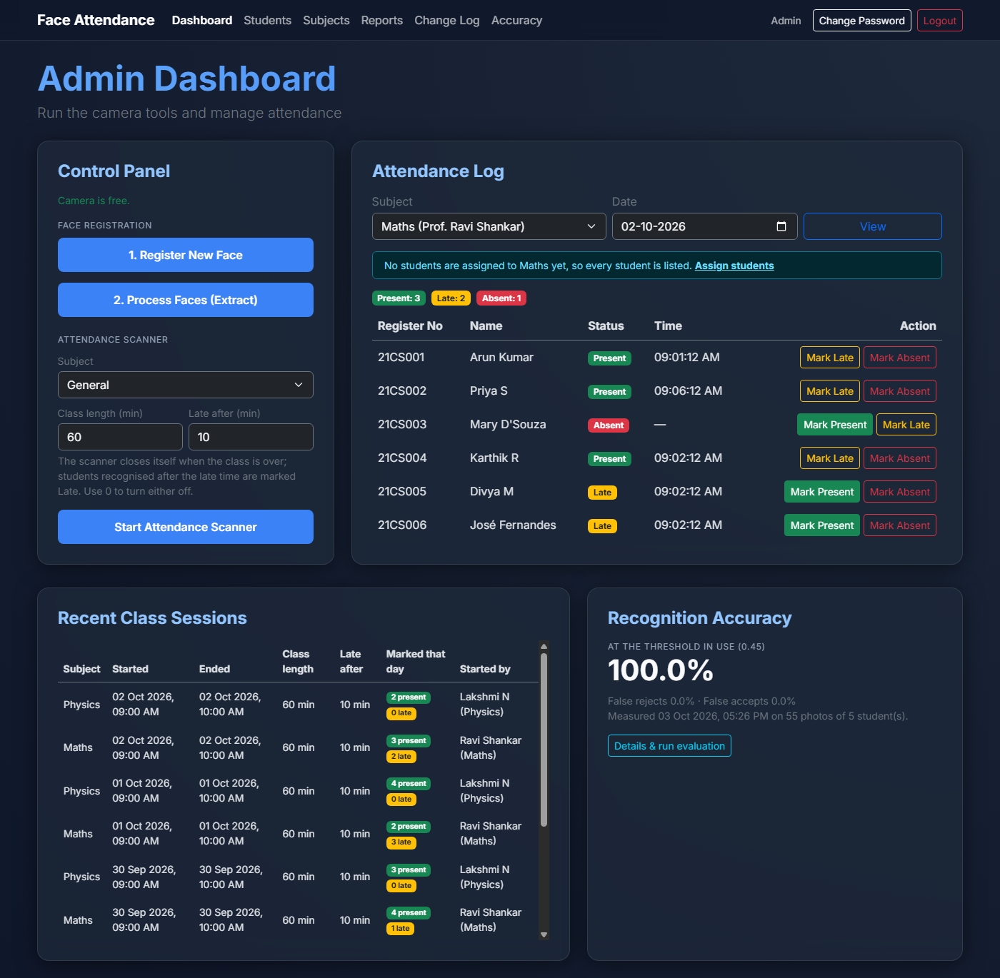
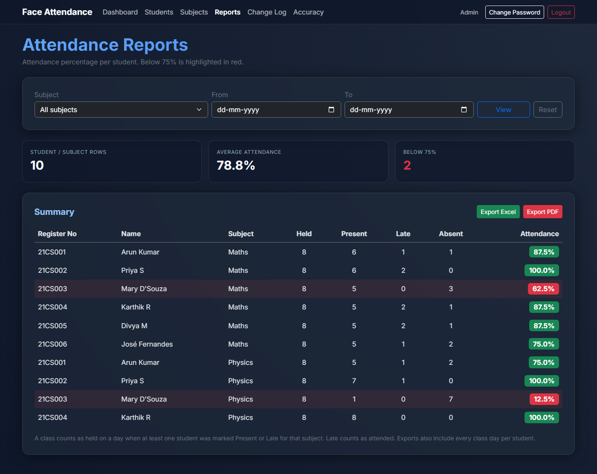
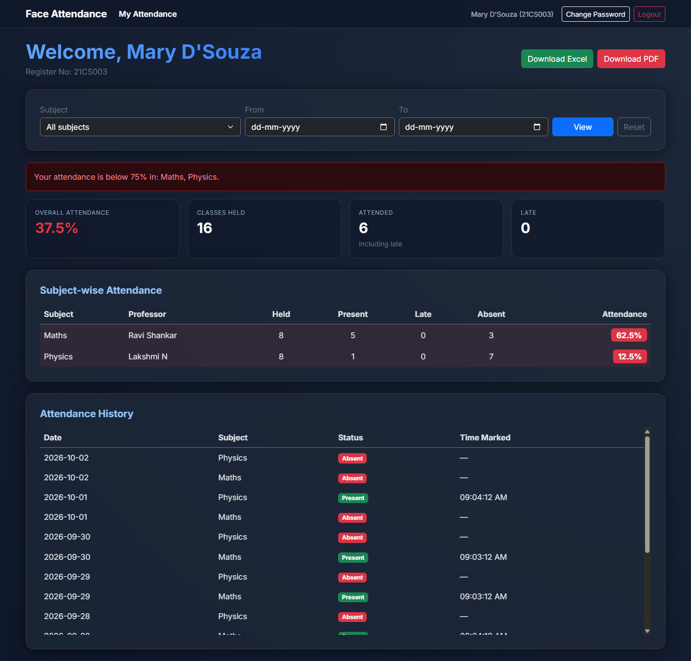
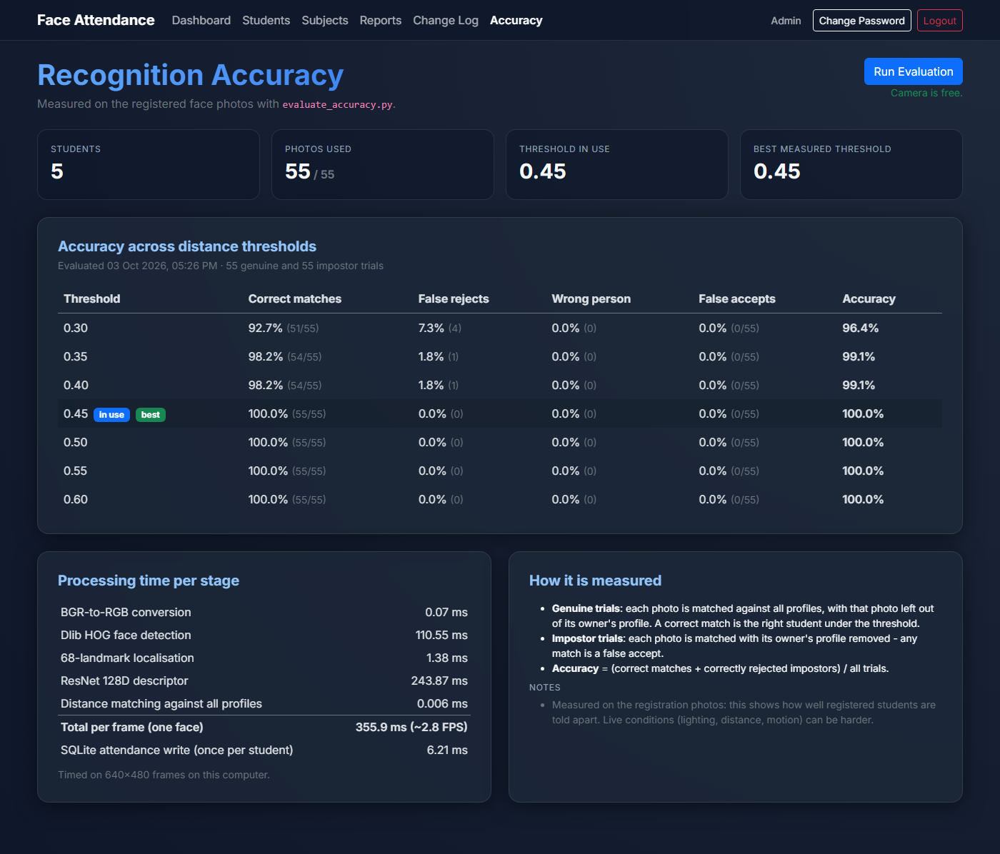

# Face Recognition Based Attendance System

A webcam attendance system for colleges and classrooms. Students register their face once; during class the scanner recognises them and records attendance automatically for the subject being taught. A web dashboard gives the **admin**, **staff** (one login per subject) and **students** everything they need: live attendance logs, manual corrections with an audit trail, attendance percentages with below-75% warnings, and Excel/PDF reports.

Face recognition uses [dlib](http://dlib.net/)'s ResNet model (128-dimensional face descriptors); the web app is built with Flask, SQLite and Bootstrap 5.



## Features

**Face recognition**
- Face registration window: enter the student's details and save 10 photos from the webcam. Only one person may be in frame, and each new photo is checked against the student's first photo so a wrong face is noticed immediately.
- Live attendance scanner that recognises several faces at once and marks each student once per subject per day.
- Class sessions: set the class length and the scanner closes itself when the class is over; students recognised after the "late after" time are marked **Late**.
- Real, measured accuracy: `evaluate_accuracy.py` runs leave-one-out and impostor tests on the registered photos and times every processing stage. Results are shown on the dashboard - nothing is hardcoded.

**Web dashboard**
- **Admin** - start the camera tools, view and correct attendance for any day, manage students and subjects, assign students to subjects, bulk-import students from CSV, view reports, the change log and the accuracy page.
- **Staff** - start the scanner for their subject, correct today's attendance, view recent class sessions and their subject's report.
- **Student** - overall and subject-wise attendance percentages, a below-75% warning, full attendance history and downloads of their own report.
- Attendance percentage per student and subject with low attendance highlighted.
- Excel (`.xlsx`) and PDF export for a subject or all subjects and any date range.
- Change log: every manual Present / Late / Absent change records who made it and when.
- Deleting a student also removes their face photos and rebuilds the face database.

**Security**
- Passwords stored as salted hashes (scrypt); nobody can see them, users can change their own.
- CSRF protection on every form and request, a random secret key, and a warning while the default admin password is still in use.
- Student photos, the database and the secret key stay on your computer (excluded from git).

## How it works

```
Register face ─► 10 photos ─► features_extraction_to_csv.py ─► data/features_all.csv
                 data/data_faces_from_camera/                  (one averaged 128D
                 person_<n>_<regno>_<name>/                     descriptor per student)

Scanner, every frame:  detect faces (HOG) ─► 68 landmarks ─► 128D descriptor ─►
                       nearest registered student ─► distance < 0.45 ? mark Present/Late
```

The face database is rebuilt automatically after a student's 10th photo, when a student is deleted, and by the scanner whenever photos were added or removed since the last build.

## Requirements

- Python **3.10 - 3.13** (64-bit) on Windows, Linux or macOS
- A webcam
- An internet connection for the first setup (Python packages and the ~85 MB face models)
- Linux only: Tkinter, e.g. `sudo apt install python3-tk`

## Installation and running

### Windows - quick start

1. Download or clone this repository.
2. Double-click **`setup.bat`** - it creates a virtual environment, installs the packages and downloads the face models.
3. Double-click **`start.bat`** - the server starts and the dashboard opens at <http://127.0.0.1:5000>.

### Any operating system - manual steps

```bash
git clone https://github.com/arunkumartm68/Face-Recognition-Attendance-System.git
cd Face-Recognition-Attendance-System

python -m venv venv
venv\Scripts\activate            # Windows
# source venv/bin/activate       # Linux / macOS

pip install -r requirements.txt
python download_models.py        # dlib models -> data/data_dlib/
python app.py                    # then open http://127.0.0.1:5000
```

### First login

| Role    | Username                      | Password                     |
|---------|-------------------------------|------------------------------|
| Admin   | `admin`                       | `admin` - change it after the first login |
| Staff   | the subject name (e.g. `Maths`) | set by the admin           |
| Student | register number (or name)     | set when the student is added |

## Using the system

1. **Add subjects** - *Subjects* page. Each subject has its own staff login (subject name + password) and an optional professor name.
2. **Add students** - *Students* page, one at a time or **Bulk Import (CSV)**. Students can also be created directly in the face registration window.
   ```csv
   register_number,name,password,subjects
   21CS001,Arun Kumar,changeme1,Maths;Physics
   21CS002,Priya S,changeme2,
   ```
3. **Register faces** - *Dashboard* → **1. Register New Face**. In the window: enter the Reg No, Name and Password → **Input**, then click **Save current face** 10 times while the student slightly turns their head. The face database updates automatically after the 10th photo (**2. Process Faces** rebuilds it manually).
4. **Assign students to subjects** (optional) - *Subjects* → **Assign Students**. Until a subject has assigned students, every student is expected in it.
5. **Take attendance** - on the staff dashboard (or the admin dashboard, choosing a subject) set the class length and the late time and click **Start Attendance Scanner**. Students look at the camera; the window closes by itself at the end of the class, or press **Q** / close the window to stop early.
6. **Correct mistakes** - *Mark Present / Late / Absent* in the attendance log (staff: today only, admin: any day). Every change appears in the *Change Log*.
7. **Reports** - attendance percentages with below-75% highlighted and Excel/PDF export. Students see their own dashboard and can download their report.
8. **Accuracy** - *Accuracy* → **Run Evaluation** (or `python evaluate_accuracy.py`) after registering at least two students.

**Attendance rules:** one record per student, subject and day. A class counts as held on a day when at least one student was marked Present or Late. Late counts as attended.

## Screenshots

*(sample data)*

| Reports | Student dashboard |
|---|---|
|  |  |



## Command-line tools

| Command | Purpose |
|---|---|
| `python app.py` | Web dashboard |
| `python get_faces_from_camera_tkinter.py` | Face registration window |
| `python features_extraction_to_csv.py` | Rebuild the face database |
| `python attendance_taker.py "Maths" --duration 60 --late-after 10` | Attendance scanner (`--source` also accepts a video file or IP-camera URL) |
| `python evaluate_accuracy.py` | Measure accuracy and processing time |
| `python download_models.py` | Download the dlib models (resumes interrupted downloads) |

## Configuration

Optional environment variables:

| Variable | Default | Meaning |
|---|---|---|
| `FACE_MATCH_THRESHOLD` | `0.45` | Largest descriptor distance accepted as the same person. Lower = stricter. |
| `HOST` / `PORT` | `127.0.0.1` / `5000` | Server address. `HOST=0.0.0.0` makes the dashboard reachable from other devices on your network - change the admin password first. |
| `FLASK_DEBUG` | off | `1` enables auto-reload while developing. |
| `SECRET_KEY` | random, saved in `data/.secret_key` | Key that signs login sessions. |
| `ATTENDANCE_DB` / `ATTENDANCE_DATA_DIR` | `attendance.db` / `data/` | Where the database and data files are stored. |

## Accuracy and speed

Run `python evaluate_accuracy.py` (or *Accuracy* → *Run Evaluation*) on your own students:

- **Genuine trials** - each photo is matched against every profile with that photo left out of its owner's profile.
- **Impostor trials** - each photo is matched with its owner's profile removed; any match is a false accept.
- It reports correct matches, false rejects, wrong-person matches, false accepts and accuracy for thresholds 0.30 - 0.60, recommends the best threshold, and times each processing stage.

Example: on a 5-person sample of LFW face photos (55 images), the default threshold 0.45 matched all 55 genuine trials correctly with 0 false accepts. On the development laptop's CPU one frame took about 356 ms (about 2.8 FPS), most of it in dlib's ResNet descriptor. Your results depend on your camera, lighting and students - measure them.

## Running the tests

```bash
python -m unittest discover -s tests -v
```

The face-pipeline tests need the downloaded models. The test that opens an OpenCV window runs only when `RUN_GUI_TESTS=1` is set.

## Project structure

```
├── app.py                            Flask web dashboard (admin / staff / student)
├── common.py                         Settings, database schema and migrations, shared helpers
├── reports.py                        Attendance percentages, Excel and PDF export
├── face_utils.py                     OpenCV/dlib helpers: models, image I/O, face database file
├── get_faces_from_camera_tkinter.py  Face registration window
├── features_extraction_to_csv.py     Builds data/features_all.csv
├── attendance_taker.py               Live attendance scanner (class sessions, late marking)
├── evaluate_accuracy.py              Measures accuracy and processing time
├── download_models.py                Downloads the dlib models
├── setup.bat / start.bat             One-click setup and launcher for Windows
├── requirements.txt
├── templates/                        Web pages (Bootstrap 5)
├── tests/                            Automated tests
├── docs/screenshots/
└── data/
    ├── data_dlib/                    dlib models (downloaded, not in git)
    └── data_faces_from_camera/       Registered face photos (stay on your computer)
```

## Troubleshooting

- **"Face recognition models are missing"** - run `python download_models.py`.
- **The camera does not open** - close other apps that use the webcam (Zoom, Teams, the camera app). Only one camera tool can run at a time.
- **A student is not recognised** - register at least 10 clear photos in similar lighting to the classroom, then check the *Accuracy* page.
- **`No module named tkinter`** (Linux) - `sudo apt install python3-tk`.
- **Forgot the admin password** - reset it to `admin` from the project folder:
  ```bash
  python -c "import common; c = common.connect(); c.execute('UPDATE admins SET password = ? WHERE username = ?', (common.hash_password('admin'), 'admin')); c.commit()"
  ```

## Acknowledgements

- Based on [Arijit1080/Face-Recognition-Based-Attendance-System](https://github.com/Arijit1080/Face-Recognition-Based-Attendance-System).
- Face detection, landmark and recognition models by Davis King, [dlib](http://dlib.net/).
